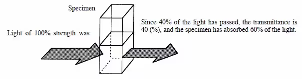
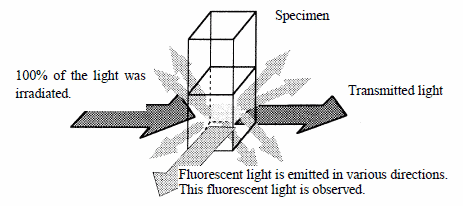

# 酶标仪使用指南

## 基础操作

### 一、 仪器日常维护与开机

1. 保持酶标仪所在空间处于较为干燥的状态，控制室内湿度，
2. 开机前请确保操作环境湿度在 15%~60%之间。
3. 打开仪器和电脑，在初始化过程中请不要对仪器进行任何设置
   
### 二、请根据样品性质和所需数据选择检测模式
1. 五种测量模式: ``ABS（光吸收）``; ``FL（荧光）``; ``LUM（发光）``; ``TRF``; ``FP``
2. 四种读数方式:``Endpoint（终点法）``; ``Spectrum（光谱）``;`` Kinetics（动力学）``; ``Well scar（孔扫描）``

### 三、软件操作
1. 将仪器与电脑连接。
2. 建立``"new experiment”``，选择比色皿操作或者读板读数。
   
   比色皿是``new cuvset``，多孔板是``new plate ``

3. 进入“Settings”界面，根据参考文献设置参数，

4. 由于仪器寿命有限，预实验尽量不要设置过于密集的测量步长（最低1nm）

### 四、比色皿的使用

1. 使用前先用蒸馏水清洗几次，**切记不可用超声清洗机！！**
2. 对于荧光和紫外测量请分别使用**对应的比色皿**。<>荧光：四面透光，紫外：两面透光（石英）
3. 尽量不要接触比色皿透光面，按照仪器内部箭头的方向放置比色皿
4. 将样品进行适当稀释，用3-3.5mL的样品进行检测,避免将样品流入检测室内部
5. 对于紫外测量，OD 值大于1的数据不可使用，需要将样品进行适当稀释
6. 测量结束后请将比色皿中液体倒干净，井用蒸馏水清洗三次

## UV-Vis测试

### 测样

1. New Cuvette Set，建立以石英比色皿为容器的测试；
2. 在Cuvette Tools中选择New，新建实验；点击Settings按钮，设置试验方案
3. 在Read Mode中选择ABS，Read Type中选择Spectrum，设置扫描起始位置(Start)和终点位置 (Stop)，设置扫描步长 (step)，点击OK，关闭Settings界面；
4. 在section中选择reference，扫描参比，扣除背景
5. 在section中选择sample，开始扫描样品UV-Vis。

### 导出数据
1. 在自己的文件夹中新建一个Excel表格
2. 在软件中，右键点击图片，复制数据，在Excel中粘贴数据
3. 拷贝数据在origin中作图。

## 荧光测试

在荧光分光光度法中，激发光的能量被吸收，然后转化为不同形式的光，即荧光，荧光的波长总会比激发光的波长长。一些能量在转换过程中发生损失，还有一些能量被吸收，不是所有的激发光都能转换为荧光。因此观察到的光和照射的光会具有不同的波长。

在荧光光度法中，我们需要检测的是荧光而不是激发光，因此，不希望激发光进入检测系统。

同时，由于荧光和激发光的波长的不同，荧光分光光度法中有两种扫描模式（Scan mode），一种是Excitation，一种是Emission；得到的光谱为：荧光激发光谱和荧光发射光谱

a)固定激发波长(Excitation)扫描发射波长(Emission)，**起始发射波长必须比固定激发波长要大**。

b)固定发射波长(Emission)扫描激发波长(Excitation)，**终止激发波长必须比固定发射波长要小。**

1. ``New Cuvette Set``，建立以石英比色皿为容器的测试；
2. 在``Cuvette Tools``中选择``New``，新建实验；点击``Settings``按钮，设置试验方案
3. 在``Read Mode``中选择``FL``测试荧光，``Read Type``中选择``Spectrum``
4. 发射光谱Excitation：在``Wavelength Settings``界面，选择``Ex Fixed/Em Sweep``，选择激发波长 (Excitation)，然后选择发射光谱 (Emission)，得到发射光谱曲线峰值
5. 激发光谱Emission：切换至``Em fixed/Ex Sweep``，输入Emission波长 (取上一步峰值处)，设置Excitation 起始波长 (Start) 和终点波长 (Stop)，设置扫描步长 (step)，点击OK。
6. 反复进行上述过程，直到当发射波长和激发波长互扫的峰值相对应，即确定激发波长与发射波长，并绘制荧光光谱。
