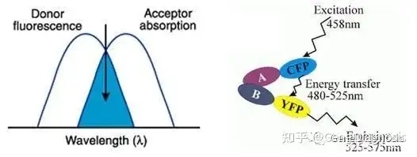
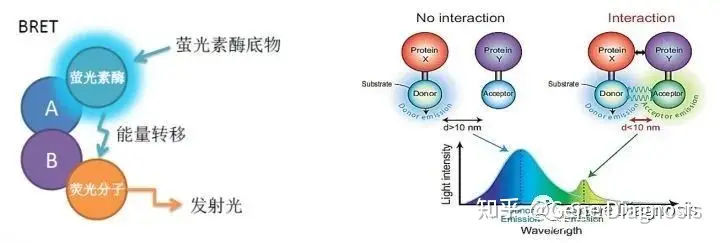

# 理论

酶标仪即酶联免疫检测仪，酶标仪检测技术是一种高通量微孔板检测技术，操作简便，被广泛应用于生命科学、生物制药、体外诊断、食品安全、环境科学等领域。传统酶标仪是指具备吸收光检测功能的酶联免疫检测仪，随着科学技术发展和市场需求不断丰富，如今酶标仪所具备的检测功能日益丰富，在光吸收检测(Abs)基础上增加了荧光强度(FI)、发光检测(Lum)、荧光偏振(FP)、时间分辨荧光(TRF)、匀相时间分辨荧光(HTRF)等多种检测技术。然而每一种技术都具有独特的应用价值和局限性，下面将对几个主流技术进行详细介绍。

## 吸收光检测

工作原理与主要结构和光电比色计基本相同，在特定波长下检测被测物的吸光值，称为光吸收检测（Absorbance，Abs）。只做吸收光检测的酶标分析仪实际上就是一台变相光电比色计或分光光度计，其基本工作原理与主要结构和光电比色计基本相同。光源发出的光波经过滤光片或单色器变成一束单色光，进入塑料微孔板中的待测标本。

该单色光一部分被标本吸收，另一部分则透过标本照射到光电检测器上，光电检测器将这一待测标本不同而强弱不同的光信号转换成相应的电信号，电信号经前置放大，对数放大，模数转换等信号处理后送入微处理器进行数据处理和计算，最后由显示器和打印机显示结果。特定波长下，同一种被检测物的浓度与被吸收的能量成定量关系，即符合朗伯比尔定律。

### 朗伯比尔定律

典型应用：核酸和蛋白质定量、ELISA、酶学检测、细菌生长OD600测定、内毒素检测、MTT/CCK8等细胞活力分析。

### 荧光强度
荧光(Fluorescence)是一些原子和分子吸收特定波长的光（激发：Ex），随后短暂发射 (Em) 更长波长的光的特性。激发峰和发射峰之间的距离称为斯托克斯 (Stokes) 位移，该位移取决于荧光基团。荧光利用一个外部光源，在特定波长下激发样品，荧光基团受到适当波长的激发，分子从基态转化成激发态。随着分子回到基态，能量会以热（损失能量）和能量更低、波长更长的光的形式释放。

具备荧光强度 (FI) 检测模式的微孔板读板机使用一种光源（通常是氙闪灯或 LED），来激发特定波长的荧光基团（荧光分子）。可以使用一个特定波长的滤光片或可连续调节波长的单色器，来选择激发样品所需的波长。

荧光基团随后会释放出一个不同波长的发射光，经由另一个滤光片或单色器进入检测器 PMT。光电倍增管 (PMT) 可以检测这种发射的荧光值，样品的荧光强度用相对荧光强度单位（RFU）表示。

### 荧光检测示意图
荧光强度即发射荧光的光量子数，荧光强度与溶液吸收光强度，荧光量子效率以及周围环境等因素有关。荧光的颜色多为红色、绿色、蓝色等。

典型应用：核酸等生物大分子定量、酶活性分析、荧光免疫分析、细胞学分析(细胞增殖、细胞毒理、细胞吸附等)、胞内钙离子浓度的变化、荧光蛋白的报告基因分析 (GFP)、细胞凋亡等。

### 发光检测
发光检测(Luminescence, Lum)包括化学发光(Chemiluminescence)和生物发光(Bioluminescence)，是样本孔内发生的化学、生化或者酶反应发出的光信号。与光吸收和荧光检测不同的是，发光检测不需要激发光源，这就使得发光更敏感，更不容易引起背景噪音。

化学发光是由化学反应引起的一种特殊的发光现象，即通过氧化还原反应释放的能量将体系中某一物质从基态跃迁至激发态，随后以辐射发光(紫外光、可见光或近红外光)的形式返回基态释放能量。其过程由化学激发过程和发光过程两部分组成。根据能量作用过程，发光可以是一种“闪光”或“辉光”反应，这取决于其动力学特征。闪光型发光会在短时间（通常是几秒）内发出非常明亮的信号。辉光型发光发射的信号更加稳定，但通常较弱，可持续几分钟甚至几小时。

生物发光是生物体内的**发光蛋白通过消耗能量物质而产生的发光现象**，其特点是只消耗能量物质,不消耗发光物质。**生物发光属于冷光范畴**,即发**光不是由于发光体温度升高所致,发射波长也与其温度无关**。目前被发现的生物发光底物有虫荧光素、腔肠素、虾素等。

与光吸收和荧光相比，发光是一个适合许多应用的极其普遍的检测方法。它通常有较宽的动态范围和较高的灵敏度（比荧光高2-3个数量级），因为背景干扰（化合物、培养基和细胞的自发荧光）较低。此外，发光测定常常是均相的（无清洗步骤），因此在高通量应用中能更简单地进行自动化操作。

典型应用：单/双荧光素酶报告基因、BRET、细胞活力检测、细胞增殖检测、支原体检测、细胞毒性检测、ATP、dsDNA、水母发光蛋白Ca2+、基于化学发光的ELISA检测等。

### 荧光偏振
当荧光分子受平面偏振光激发时，如果分子在受激发时期保持静止，发射光将位于同样的偏振平面。如果在受激发时期，分子旋转或翻转偏离这一平面，发射光将位于与激发光不同的偏振面。这一现象称为荧光去偏振（Fluorescence Polarization ，FP）。FP用于检测溶液中生物大分子与小分子之间的相互作用。大、小分子未结合时，荧光标记的小分子运动速度快，发射光去偏振化，检测到低的毫偏振值(mP)；而当荧光标记的小分子与生物大分子结合后，旋转变慢，发射光保持偏振性，检测到高的毫偏振值(mP)，mP值的高低与分子相互结合的效率成正比。

典型应用：受体/配体研究(如激素/受体检测)，蛋白质/多肽相互作用，DNA/蛋白质相互作用，酪氨酸激酶检测，竞争性免疫检测、单核苷酸多态性筛选、实时定量PCR-FP、体外细胞损失检测等。

### 荧光共振能量转移
1948年，Foster首次提出荧光共振能量转移(Fluorescence Resonance Energy Transfer，FRET)理论，指两个荧光基团间能量通过偶极-偶极耦合作用以非辐射方式从供体(Donor)传递给受体(acceptor)的现象。FRET程度与供、受体分子的空间距离紧密相关，一般为7~10 nm时即可发生FRET。随着距离延长,FRET 呈显著减弱。

想要实现FRET，荧光供体和受体分子必须满足以下几个前提条件：

(1)供体分子的发射光谱和受体分子的吸收光谱须有一定程度的重叠，一般大于30%(重叠越多，FRET效果越好);

(2)供体分子和受体分子间的距离须小于10nm(一般为7～10nm);

(3)供体分子和受体分子的共振方向须平行或近似平行；

FRET主流的荧光探针主要有三种：荧光蛋白、传统有机分子和镧系元素。

典型应用：蛋白结构和构象改变、蛋白的空间分布和组装、受体/配体相互作用、核酸结构和构象改变、脂类的分布和转运、膜蛋白的研究、核酸检测等应用。

#### 生物发光共振能量转移
生物发光能量共振转移(Bioluminescence Resonance Energy Transfer, BRET)检测原理与FRET类似，不同的是供体产生生物发光来激发受体荧光分子，无需激发光，背景更低，也避免了光漂白和自发荧光等问题。

BRET与FRET相比，供体采用萤光素酶生物发光，不再需要激发光，因为没有样品自发光干扰，所以背景更低，信噪比更高。

典型应用：活细胞中蛋白质-蛋白质相互作用。

### 时间分辨荧光
时间分辨荧光(Time-resolved fluorescence, TRF)是一种高级荧光检测技术，使用镧系金属做荧光标记(其荧光比普通荧光持续时间更长，普通荧光的半衰期为纳秒级，镧系元素的半衰期是毫秒级)，利用荧光分子之间荧光寿命的差异来分离所需的荧光信号。

与传统荧光检测方法相比，TRF具有灵敏度高、样品制备简单、检测重复性好的优点。最常使用的镧系元素是铕(Eu)、铽(Tb)、钐(Sm)和镝(Dy)为标记物，来代替常用的荧光物质对抗原抗体进行标记，这些镧系元素通常以螯合物的形式应用以获得优质的信号强度和稳定性,并使用带有时间分辨荧光检测功能的仪器(如酶标仪)来对荧光强度信号进行检测，最终绘制标准荧光曲线，定量分析待测物的浓度。

典型应用：GPCR测定、激酶测定、细胞因子和生物标志物检测、细胞代谢、蛋白质-蛋白质相互作用、受体-配体相互作用、药物发现、高通量筛选等。

### 均相时间分辨荧光
均相时间分辨荧光(Homogeneous Time-Resolved Fluorescence, HTRF)是基于TRF技术衍生出的新技术，将TRF技术和FRET技术相结合，能量供体选择镧系元素铕(Eu)和铽(Tb)的穴状化合物，交联别藻蓝蛋白(cross-linked APC)或小分子荧光探针d2作为受体，当供体和受体距离足够近时，供体被一个能量源激发，可以引发能量转移到受体，使其在特定波长发出荧光，用于检测生物分子之间的相互作用。

检测时，通过延缓检测时间，让短寿命的荧光衰变掉后，再检测荧光强度，消除背景荧光的干扰。同时HTRF技术在均相溶液中一步反应，无需包被、封闭、洗涤等繁琐的操作步骤。因此该技术具有背景低、特异性好、操作简单、体系稳定等优点。

典型应用：GPCRs配体结合、细胞水平的蛋白激酶实验、蛋白磷酸化、生物治疗药物研发、蛋白互作、生物因子或者趋化因子等。

